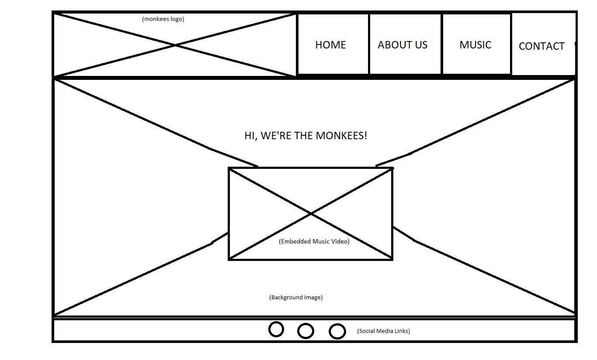
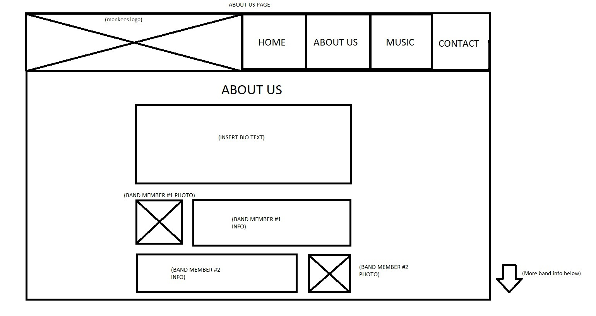
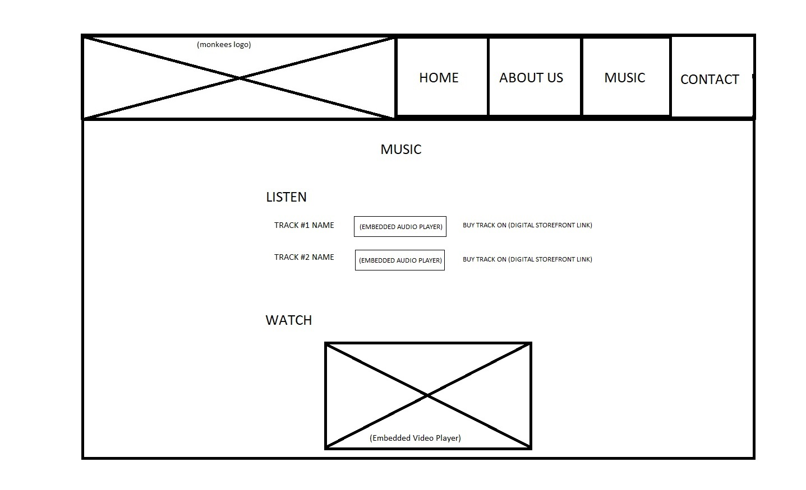
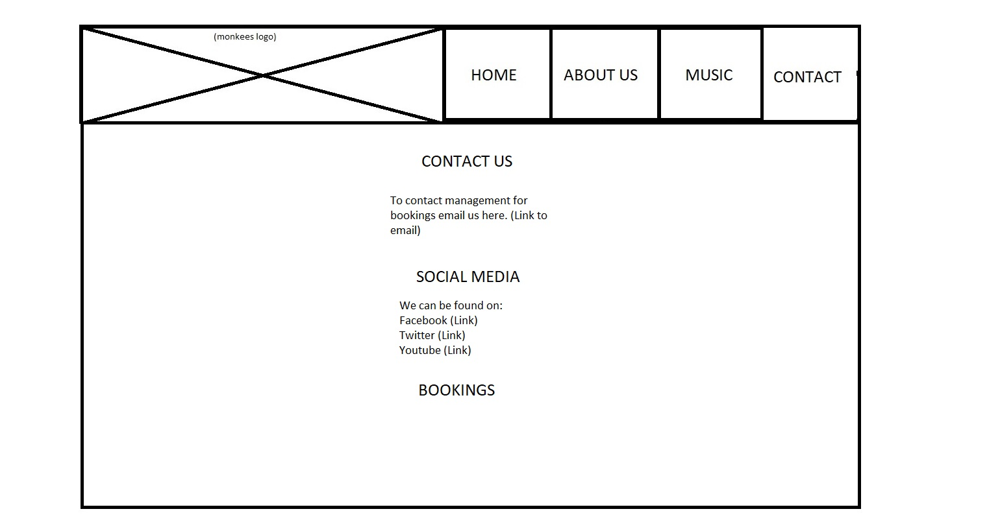
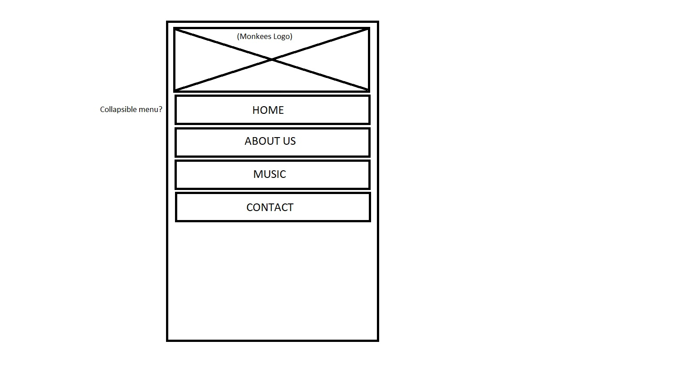

# Front End Project

The idea for this project is to create a website for a 1960's pop band using only front-end technologies such as CSS and HTML, but excluding JavaScript. The project is intended to be as user-centric focused as possible.

This is the first project as part of my [Code Institute](https://codeinstitute.net/) online diploma course.

---

## User Experience Design

### User Stories

These are potential actions that users of the website would want to perform. They have to be taken into account when building the website.

* As a fan, I want to hear music clips from band 
* As a fan I want to be updated on new music the band releases
* As a fan I want to buy some of the band's music/see what they have
* As a client I want to see if this band is any good/hear from others
* As a client I want to book band for a gig
* As a client I want to contact the band 
* As a fan I want to know more about the band
* As a fan I want to see pictures of the band
* As a fan I want to watch a video of the band
* As a fan I want want to visit the band's social media

### Wireframes
 
These are preliminary wireframes made in MS paint in order to get a rough visual idea of what the website will look like.

#### Home Page

#### About Page

#### Music Page

#### Contact Page

#### Mobile Navbar

---

## Features

### Existing Features

* The site features a navbar at the top of each page which allows the user to easily access all the pages, regardless of which page they are on. This navbar is responsive and will change size to fit on all screen sizes.

* The site has information about the band and pictures of them; which can be found on the 'music' and 'about' pages.

* The site features social media links in the footer of each page as well as the 'contact' page. (Note that these links only open the homepage of their respective sites, and do not actually reference the band specifically).
 
* There are music files to listen to and links to youtube videos, which can be found on the 'home' page and 'music' page.

* There is a contact form on the 'Contact' page which can be used to contact the band for a variety of reasons (again, this project being front-end only, the form doesn't actually transmit data).

### Features Left to Implement

* Could potentially put in an animation when clicking the band logo in the navbar.

* Could provide functionality for buying music directly from the website as opposed to using a third party site. Also could sell tickets directly from the website as well.

* The navbar could be made to collapse on mobile devices in order to conserve more screen area.

---

## Technologies Used

* [Cloud9](https://c9.io/login) - Provided a platform for all actual coding and git version control, as well as uploading to Github

* [HTML5](https://developer.mozilla.org/en-US/docs/Web/Guide/HTML/HTML5) - Provides the basic structure needed for the website to function.
    
* [CSS3](https://developer.mozilla.org/en-US/docs/Web/CSS/CSS3) - Allows the basic website to be styled and reorganised; making it more user friendly.

* [Bootstrap 4](https://getbootstrap.com/) - Allows for special structure in the website to make it as responsive as possible.

* [Google Fonts](https://fonts.google.com/) - Provides a range of fonts more suited to this particular project.

* [Font Awesome](https://fontawesome.com/) - Provides iconography which allows the website a more professional feel.

---

## Testing

### User Stories Revisited

I have to check to see if the user stories from the design section can be met by users of the site. All of these are taken as if the user lands on the home page of the site.

* As a fan, I want to hear music clips from band
  1. Click on 'Music' tab.
  2. Click on various music elements or scroll down for music video.
* As a fan I want to be updated on new music the band releases
  1. Click on 'Twitter' link in footer
* As a fan I want to buy some of the band's music/see what they have
  1. Click on music tab
  2. Spotify links to band's music available
* As a client I want to see if this band is any good/hear from others
  1. Click on Facebook link in footer
* As a client I want to book band for a gig
  1. Click on contact link
  2. Scroll down and use the form for a booking
* As a client I want to contact the band 
  1. Click on contact link
  2. Contact the band using the form
* As a fan I want to know more about the band
  1. Click on about page
  2. Scroll down for more information on the band
* As a fan I want to see pictures of the band
  1. Click on about page
  2. Scroll down for pictures
* As a fan I want to watch a video of the band
  1. Use video on home page.
* As a fan I want want to visit the band's social media
  1. Use social media links in footer

### Responsiveness

I had to make sure that the site is usable on devices with different screen widths. Part of this was accomplished through the use of DevTools in Google Chrome. When making the site, I used the device toolbar in responsive mode in order to see how the site looked at various screen sizes.

Due to the use of Bootstrap, thankfully a lot of responsive behaviour was automatic, but there were a few problems. The Navbar in particular was difficult to get to behave on small screens. It functions mostly the same for all screens (bar a decrease in font size when getting smaller), but the biggest change is how it swaps from a horizontal bar to being on three lines at <576px width.

Some parts of pages were tweaked so that they displayed better on a larger screen, such as the social media links on the contact page, the albums on the music page, and the band info on the about page. Media queries were used to get these elements to behave properly.

I also used [Responsinator](https://www.responsinator.com/) to quickly see how the pages looked on varous devices.

### Validity

I manually checked each of the links on every page to see if they opened to the correct page, and in a new tab (in the case of external links).

I used W3C [HTML Validator](https://validator.w3.org/) and [CSS Validator](http://jigsaw.w3.org/css-validator/) to check if my code was syntactically correct.

The form on the contact page makes use of the 'required' attribute to make sure there is data in the form before it is sent off. 

### Legibility

Chrome DevTools has a contrast checker to make sure text is legible against the background. 

I checked the legibility of text against the navbar background, and found that it was too dark a colour. I used the tool to find a colour which would make the text more easily seen and changed it accordingly.

This was repeated against the backgrond images on the main body of the site. Initially these proved to be too bright, so I found a method of making the background images darker, which enhanced the legibility of the text.

---

## Deployment

The code was deployed to GitHub Pages for web hosting. This involved logging into my GitHub account and opening the code for the project. By going to the 'Settings' tab, and scrolling to the Github Pages section, the code was made live by selecting the 'master branch' from the 'source' section.

The website can be found at [this URL](https://seakonn.github.io/60s-band-front-end/)

---

## Credits

### Content

Text content copied from other sites referenced here.

* [Text for Biography section](https://en.wikipedia.org/wiki/The_Monkees)
* [Text for Peter Tork](https://en.wikipedia.org/wiki/Peter_Tork)
* [Text for Micky Dolenz](https://en.wikipedia.org/wiki/Micky_Dolenz)
* [Text for Michael Nesmith](https://en.wikipedia.org/wiki/Michael_Nesmith)
* [Text for Davy Jones](https://en.wikipedia.org/wiki/Davy_Jones_(musician))

### Media

Images used in the site are referenced here.

* [Directors Chair image](https://www.hollywoodreporter.com/thr-esq/musician-sues-monkees-discrimination-wrongful-880054)
* [Band Portrait background image](https://parade.com/224998/nancyberk/showbiz-analysis-with-the-monkees-micky-dolenz/)
* [Image of band in red shirts](https://www.rte.ie/entertainment/2016/0209/766577-the-monkees-to-reform-with-new-album-and-tour/)
* [First Album Cover image](https://upload.wikimedia.org/wikipedia/en/e/e8/The_Monkees_Album.jpg)
* [Second Album Cover image](https://upload.wikimedia.org/wikipedia/en/thumb/8/8c/Moreoftm.jpg/220px-Moreoftm.jpg)
* [Third Album Cover image](https://upload.wikimedia.org/wikipedia/en/thumb/3/3d/Headquarters_-_The_Monkees.jpg/220px-Headquarters_-_The_Monkees.jpg)
* [Monkees logo](https://www.bandlogojukebox.com/blog/2017/12/4/m1-the-monkees)

All other images and music provided by Code Institute

### Code

* [Code used to make background images darker](https://css-tricks.com/design-considerations-text-images/)